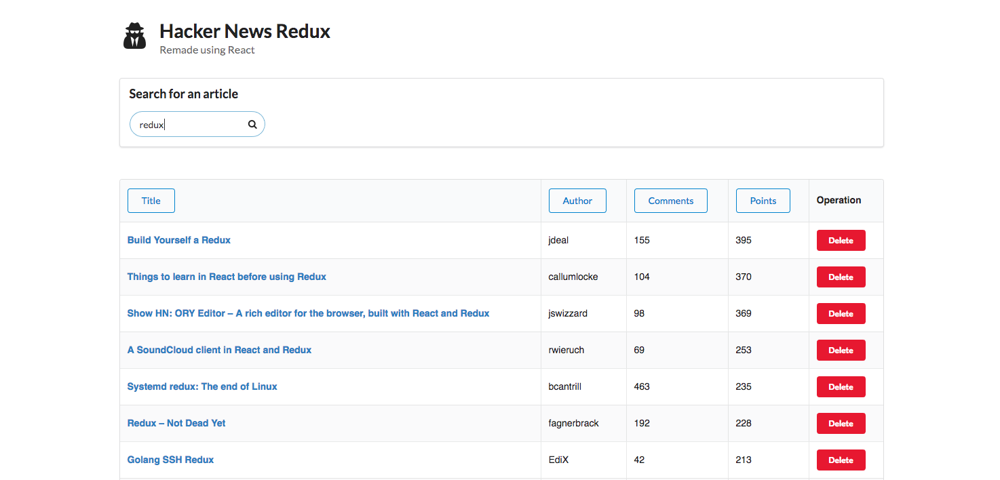

# Hacker News Redux
This is a remake of [Hacker News](https://news.ycombinator.com/) made in React, to change it to a front-end single-page application, infused with a much more modern look.

# Build & Run
This application is scaffolded using [create-react-app](https://github.com/facebook/create-react-app), so the flow is the standard one:

* Make sure you have `git` and `node` installed.
* First, clone this repo: `git clone https://github.com/charliegdev/hacker-news-redux.git`
* Then, install all dependencies: `cd hacker-news-redux && npm install`
* To start the server: `npm start`
* To run snapshot and unit tests: `npm test`

# Supported Functions
1. List all news
1. Search for new topics using the Hacker News API
1. Load additional news
1. Sort and reverse sort

# Technology
* [React](https://reactjs.org/) for the view layer
* [Semantic UI](https://semantic-ui.com/) for styling
* [axios](https://github.com/axios/axios) for http calls
* [Lodash](https://lodash.com/) for assisting data manipulation
* [Jest](https://jestjs.io/) for snapshot testing
* [Enzyme](https://github.com/airbnb/enzyme) for unit testing
* [ESLint](https://eslint.org/) for codebase linting

